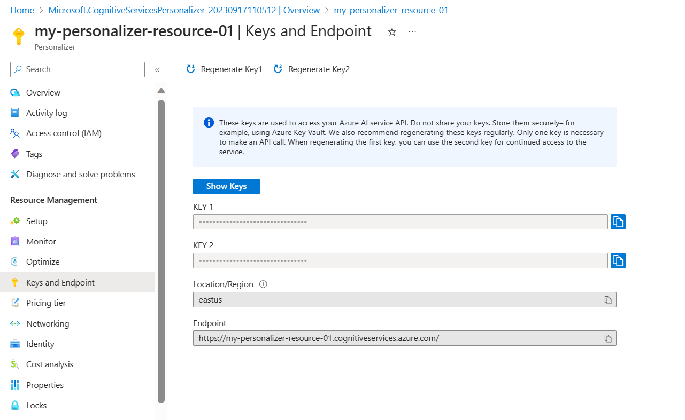

---
lab:
  title: Gunakan Personalizer AI dengan Notebook Visual Studio Code untuk mensimulasikan perulangan
---
> **Penting** Mulai musim gugur 2023, sumber daya Personalizer baru tidak dapat lagi dibuat. Hanya gunakan repositori ini untuk referensi jika Anda memiliki sumber daya Personalizer yang ada.

Dalam latihan ini, Anda akan menggunakan Azure AI Personalizer dengan notebook di Visual Studio Code untuk mensimulasikan perulangan pembelajaran.

## Membuat sumber daya Azure AI Personalizer menggunakan portal Microsoft Azure

1. Di portal Microsoft Azure, cari **layanan Azure AI**. Lalu pilih **Buat** di bawah **Personalizer** dalam daftar SharePoint hasil.

   

1. Pilih langganan Anda, masukkan nama grup sumber daya, dan beri nama untuk sumber daya Anda. Untuk tingkat harga, pilih **F0 Gratis**.
1. Pilih **Tinjau + buat** untuk meninjau pilihan Anda, lalu pilih **Buat** buat sumber daya Anda.
1. Buka sumber daya Azure AI Personalizer yang baru dibuat, lalu di panel Kunci dan Titik Akhir, salin dan tempel **Kunci** dan **Titik Akhir** di tempat yang aman untuk digunakan nanti:

   

1. Pilih Siapkan di panel navigasi, lalu atur **waktu tunggu Reward** menjadi **10 menit** (jika belum diatur), dan atur **frekuensi pembaruan Model** menjadi **15 detik**.
1. Pilih **Simpan**.

## Menyiapkan buku catatan

1. Di editor Visual Studio Code Anda, tekan **Ctrl+Shift+P** dan pilih **Buat: Jupyter Notebook baru**.
1. Simpan file dan beri nama **notebook-saya** di perangkat Anda.
1. Sekarang Anda perlu menginstal ekstensi yang diperlukan. Pilih **Pilih Kernel** di kanan atas buku catatan. Kemudian pilih **Instal/Aktifkan ekstensi yang disarankan**.

   

   > [!NOTE]
   > Jika Anda sudah melakukan ini sebelumnya, Anda tidak akan melihat opsi ini dan dapat melewati langkah ini.

1. Tunggu hingga ekstensi diinstal, lalu pilih **lingkungan Python...** di menu dropdown yang muncul.
1. Kemudian pilih lingkungan yang direkomendasikan teratas.

## Siapkan data

Untuk tujuan latihan ini, kami akan membuat daftar pengguna dan daftar produk kopi yang dapat kami gunakan sebagai data dasar untuk Azure AI Personalizer kami.

1. Salin kode JSON berikut ke dalam file kosong dan simpan file tersebut sebagai `users.json` di folder yang sama dengan file buku catatan Anda.

   ```json
   {
     "Alice": {
       "Sunny": {
         "Morning": "Cold brew",
         "Afternoon": "Iced mocha",
         "Evening": "Cold brew"
       },
       "Rainy": {
         "Morning": "Latte",
         "Afternoon": "Cappucino",
         "Evening": "Latte"
       },
       "Snowy": {
         "Morning": "Cappucino",
         "Afternoon": "Cappucino",
         "Evening": "Cappucino"
       }
     },
     "Bob": {
       "Sunny": {
         "Morning": "Cappucino",
         "Afternoon": "Iced mocha",
         "Evening": "Cold brew"
       },
       "Rainy": {
         "Morning": "Latte",
         "Afternoon": "Latte",
         "Evening": "Latte"
       },
       "Snowy": {
         "Morning": "Iced mocha",
         "Afternoon": "Iced mocha",
         "Evening": "Iced mocha"
       }
     },
     "Cathy": {
       "Sunny": {
         "Morning": "Latte",
         "Afternoon": "Cold brew",
         "Evening": "Cappucino"
       },
       "Rainy": {
         "Morning": "Cappucino",
         "Afternoon": "Latte",
         "Evening": "Iced mocha"
       },
       "Snowy": {
         "Morning": "Cold brew",
         "Afternoon": "Iced mocha",
         "Evening": "Cappucino"
       }
     },
     "Dave": {
       "Sunny": {
         "Morning": "Iced mocha",
         "Afternoon": "Iced mocha",
         "Evening": "Iced mocha"
       },
       "Rainy": {
         "Morning": "Latte",
         "Afternoon": "Latte",
         "Evening": "Latte"
       },
       "Snowy": {
         "Morning": "Cappucino",
         "Afternoon": "Cappucino",
         "Evening": "Cappucino"
       }
     }
   }
   ```

1. Selanjutnya, salin kode berikut dan simpan ke file yang disebut `coffee.json`:

   ```json
   [
     {
       "id": "Cappucino",
       "features": [
         {
           "type": "hot",
           "origin": "kenya",
           "organic": "yes",
           "roast": "dark"
         }
       ]
     },
     {
       "id": "Cold brew",
       "features": [
         {
           "type": "cold",
           "origin": "brazil",
           "organic": "yes",
           "roast": "light"
         }
       ]
     },
     {
       "id": "Iced mocha",
       "features": [
         {
           "type": "cold",
           "origin": "ethiopia",
           "organic": "no",
           "roast": "light"
         }
       ]
     },
     {
       "id": "Latte",
       "features": [
         {
           "type": "hot",
           "origin": "brazil",
           "organic": "no",
           "roast": "dark"
         }
       ]
     }
   ]
   ```

1. Salin dan tempel kode berikut ke dalam file dan simpan sebagai `example-rankrequest.json`:

   ```json
   {
     "contextFeatures": [],
     "actions": [],
     "excludedActions": [],
     "eventId": "",
     "deferActivation": false
   }
   ```

## Mengatur titik akhir dan kunci Anda

1. Di bagian atas buku catatan Anda, tambahkan kode berikut untuk menyertakan modul yang diperlukan:

   ```python
   import json
   import matplotlib.pyplot as plt
   import random
   import requests
   import time
   import uuid
   import datetime
   ```

1. Pilih sel, lalu pilih tombol jalankan di sebelah kiri sel:

   

   > [!NOTE]
   > Buat Anda memilih tombol jalankan setiap kali Anda mengisi sel baru. Jika Anda diminta untuk menginstal paket ipykernel, pilih **Instal**.

1. Pilih **+ Kode** di bagian atas buku catatan Anda untuk membuat sel kode baru. Tambahkan kode berikut:

   ```python
   # Replace 'personalization_base_url' and 'resource_key' with your valid endpoint values.
   personalization_base_url = "<your-endpoint>"
   resource_key = "<your-resource-key>"
   ```

1. Ganti nilai **personalization_base_url** dengan titik akhir yang disalin, dan nilai **resource_key** dengan kunci Anda.

## Melacak perulangan

1. Selanjutnya, Anda membuat kode membantu mencatat waktu mulai dan berakhir dari fungsi iteratif yang akan Anda gunakan nanti. Tambahkan kode berikut ke sel baru:

   ```python
   # Print out current datetime
   def currentDateTime():
       currentDT = datetime.datetime.now()
       print (str(currentDT))

   # ititialize variable for model's last modified date
   modelLastModified = ""

   def get_last_updated(currentModifiedDate):

       print('-----checking model')

       # get model properties
       response = requests.get(personalization_model_properties_url, headers = headers, params = None)

       print(response)
       print(response.json())

       # get lastModifiedTime
       lastModifiedTime = json.dumps(response.json()["lastModifiedTime"])

       if (currentModifiedDate != lastModifiedTime):
           currentModifiedDate = lastModifiedTime
           print(f'-----model updated: {lastModifiedTime}')
   ```

1. Jangan lupa untuk menjalankan sel baru setelah Anda menambahkan kode baru.

## Mendapatkan kebijakan dan konfigurasi layanan

1. Selanjutnya, Anda harus memvalidasi status layanan dengan mendapatkan kebijakan dan konfigurasi layanan. Untuk melakukan ini, tambahkan kode berikut ke sel baru:

   ```python
   def get_service_settings():

       print('-----checking service settings')

       # get learning policy
       response = requests.get(personalization_model_policy_url, headers = headers, params = None)

       print(response)
       print(response.json())

       # get service settings
       response = requests.get(personalization_service_configuration_url, headers = headers, params = None)

       print(response)
       print(response.json())
   ```

1. Pastikan untuk menjalankan sel kode baru Anda.

Kode ini terdiri dari fungsi yang melakukan dua panggilan ke API layanan. Ketika fungsi dipanggil, fungsi mengembalikan nilai layanan menggunakan respons.

## Menyiapkan URL untuk panggilan dan membaca file JSON

Sekarang Anda akan menambahkan kode ke:

- membangun URL yang digunakan dalam panggilan REST
- atur header keamanan menggunakan kunci sumber daya Personalizer Anda
- mengatur nilai awal acak untuk ID peristiwa Peringkat
- baca dalam file data JSON
- memanggil metode get_last_updated - kebijakan pembelajaran telah dihapus dalam contoh output
- memanggil metode get_service_settings

1. Untuk melakukan ini, tambahkan kode berikut ke sel baru dan jalankan:

   ```python
   # build URLs
   personalization_rank_url = personalization_base_url + "personalizer/v1.0/rank"
   personalization_reward_url = personalization_base_url + "personalizer/v1.0/events/" #add "{eventId}/reward"
   personalization_model_properties_url = personalization_base_url + "personalizer/v1.0/model/properties"
   personalization_model_policy_url = personalization_base_url + "personalizer/v1.0/configurations/policy"
   personalization_service_configuration_url = personalization_base_url + "personalizer/v1.0/configurations/service"

   headers = {'Ocp-Apim-Subscription-Key' : resource_key, 'Content-Type': 'application/json'}

   # context
   users = "users.json"

   # action features
   coffee = "coffee.json"

   # empty JSON for Rank request
   requestpath = "example-rankrequest.json"

   # initialize random
   random.seed(time.time())

   userpref = None
   rankactionsjsonobj = None
   actionfeaturesobj = None

   with open(users) as handle:
       userpref = json.loads(handle.read())

   with open(coffee) as handle:
       actionfeaturesobj = json.loads(handle.read())

   with open(requestpath) as handle:
       rankactionsjsonobj = json.loads(handle.read())

   get_last_updated(modelLastModified)
   get_service_settings()

   print(f'User count {len(userpref)}')
   print(f'Coffee count {len(actionfeaturesobj)}')
   ```

1. Panggilan harus mengembalikan respons yang mirip dengan yang berikut ini:

   ```bash
   -----checking model
   <Response [200]>
   {'creationTime': '2023-09-22T14:58:45+00:00', 'lastModifiedTime': '2023-09-22T14:58:45+00:00'}
   -----model updated: "2023-09-22T14:58:45+00:00"
   -----checking service settings
   <Response [200]>
   {'name': '917554355a3347a1af3d2935d521426a', 'arguments': '--cb_explore_adf --epsilon 0.20000000298023224 --power_t 0 -l 0.001 --cb_type mtr -q ::'}
   <Response [200]>
   {'rewardWaitTime': 'PT10M', 'defaultReward': 0.0, 'rewardAggregation': 'earliest', 'explorationPercentage': 0.2, 'modelExportFrequency': 'PT15S', 'logRetentionDays': 90, 'lastConfigurationEditDate': '2021-01-01T00:00:00', 'learningMode': 'Online'}
   User count 4
   Coffee count 4
   ```

1. Kode respons harus `<Response [200]>` untuk menunjukkan panggilan yang berhasil. **rewardWaitTime** harus ditampilkan sebagai 10 menit dan **modelExportFrequency** harus 15 detik.

## Menyiapkan bagan di portal Microsoft Azure

Kode Anda membuat permintaan ke API. Untuk mendapatkan metrik yang baik, Anda dapat membuat bagan metrik di portal Microsoft Azure:

1. Di portal Microsoft Azure, buka sumber daya Azure AI Personalizer Anda.

1. Pilih **Metrik** di bawah Pemantauan di panel navigasi.

   

1. Namespace **Cakupan** dan **Metrik** telah ditetapkan untuk Anda. Anda hanya perlu memilih **Metrik** dari **Panggilan sukses** dan **Agregasi** dari **Jumlah**.

1. Ubah filter waktu menjadi empat jam terakhir.

## Membuat ID peristiwa unik

Selanjutnya, Anda menambahkan kode untuk menghasilkan ID unik untuk setiap panggilan API peringkat. Anda menggunakan ID ini untuk mengidentifikasi informasi panggilan peringkat dan hadiah untuk permintaan.

1. Untuk melakukan ini, buat sel kode baru di buku catatan Anda dan tambahkan yang berikut ini:

   ```python
   def add_event_id(rankjsonobj):
       eventid = uuid.uuid4().hex
       rankjsonobj["eventId"] = eventid
       return eventid
   ```

1. Ingatlah untuk menjalankan sel kode baru Anda.

> [!NOTE]
> Dalam skenario nyata, Anda akan mengatur ini ke sesuatu seperti ID transaksi untuk pembelian.

## Mendapatkan pengguna, waktu hari dan cuaca

Sekarang Anda dapat menambahkan fungsi ke:

- Pilih kombinasi pengguna, waktu, dan cuaca yang unik.
- Tambahkan item yang dipilih ke objek JSON yang akan dikirim ke RANK API melalui panggilan.

Untuk melakukan ini, tambahkan kode berikut ke sel baru dan jalankan:

```python
def add_random_user_and_contextfeatures(namesoption, weatheropt, timeofdayopt, rankjsonobj):
    name = namesoption[random.randint(0,3)]
    weather = weatheropt[random.randint(0,2)]
    timeofday = timeofdayopt[random.randint(0,2)]
    rankjsonobj['contextFeatures'] = [{'timeofday': timeofday, 'weather': weather, 'name': name}]
    return [name, weather, timeofday]
```

## Menambahkan data kopi

Selanjutnya, Anda membuat fungsi untuk mendapatkan seluruh daftar produk kopi ke objek JSON yang kemudian Anda kirim ke Rank API.

Untuk melakukan ini, Anda menambahkan kode berikut ke sel baru dan menjalankannya:

```python
def add_action_features(rankjsonobj):
    rankjsonobj["actions"] = actionfeaturesobj
```

## Membandingkan prediksi dengan preferensi pengguna yang diketahui

Anda kemudian dapat membuat fungsi untuk membandingkan preferensi pengguna untuk kopi tertentu, dengan mempertimbangkan detail seperti cuaca dan waktu hari, dengan apa yang disarankan Azure AI Personalizer.

1. Untuk melakukan ini, buat sel baru, tambahkan kode berikut, dan jalankan:

   ```python
   def get_reward_from_simulated_data(name, weather, timeofday, prediction):
       if(userpref[name][weather][timeofday] == str(prediction)):
           return 1
       return 0
   ```

1. Fungsi ini dimaksudkan untuk berjalan setelah setiap kali RANK API dipanggil. Jika saran cocok, skor `1` dikembalikan dalam respons. Jika tidak cocok, `0` akan dikembalikan.

## Membuat perulangan dengan panggilan ke API Peringkat dan Hadiah

Sel sebelumnya digunakan untuk menyiapkan buku catatan Anda untuk perulangan. Sekarang Anda akan mengonfigurasi perulangan Anda. Perulangan mencakup isi utama pekerjaan di buku catatan Anda. Ini mendapatkan pengguna acak, mendapatkan daftar kopi, dan mengirim mereka berdua ke RANK API. Ini membandingkan prediksi dari Azure AI Personalizer dengan preferensi pengguna yang diketahui, lalu mengirim hadiah kembali ke Azure AI Personalizer.

Untuk membuat perulangan Anda, tambahkan kode berikut ke sel baru dan jalankan:

```python
def iterations(n, modelCheck, jsonFormat):

    i = 1

    # default reward value - assumes failed prediction
    reward = 0

    # Print out dateTime
    currentDateTime()

    # collect results to aggregate in graph
    total = 0
    rewards = []
    count = []

    # default list of user, weather, time of day
    namesopt = ['Alice', 'Bob', 'Cathy', 'Dave']
    weatheropt = ['Sunny', 'Rainy', 'Snowy']
    timeofdayopt = ['Morning', 'Afternoon', 'Evening']


    while(i <= n):

        # create unique id to associate with an event
        eventid = add_event_id(jsonFormat)

        # generate a random sample
        [name, weather, timeofday] = add_random_user_and_contextfeatures(namesopt, weatheropt, timeofdayopt, jsonFormat)

        # add action features to rank
        add_action_features(jsonFormat)

        # show JSON to send to Rank
        print('To: ', jsonFormat)

        # choose an action - get prediction from Personalizer
        response = requests.post(personalization_rank_url, headers = headers, params = None, json = jsonFormat)

        # show Rank prediction
        print ('From: ',response.json())

        # compare personalization service recommendation with the simulated data to generate a reward value
        prediction = json.dumps(response.json()["rewardActionId"]).replace('"','')
        reward = get_reward_from_simulated_data(name, weather, timeofday, prediction)*10

        # show result for iteration
        print(f'   {i} {currentDateTime()} {name} {weather} {timeofday} {prediction} {reward}')

        # send the reward to the service
        response = requests.post(personalization_reward_url + eventid + "/reward", headers = headers, params= None, json = { "value" : reward })

        # for every N rank requests, compute total correct  total
        total =  total + reward

        # every N iteration, get last updated model date and time
        if(i % modelCheck == 0):

            print("**** 10% of loop found")

            get_last_updated(modelLastModified)

        # aggregate so chart is easier to read
        if(i % 10 == 0):
            rewards.append( total)
            count.append(i)
            total = 0

        i = i + 1

    # Print out dateTime
    currentDateTime()

    return [count, rewards]
```

Berikut adalah contoh struktur JSON yang dikirim fungsi ke RANK API:

```python
{
    'contextFeatures':[
      {
          'timeofday':'Evening',
          'weather':'Snowy',
          'name':'Alice'
      }
    ],
    'actions':[
      {
          'id':'Cappucino',
          'features':[
            {
                'type':'hot',
                'origin':'kenya',
                'organic':'yes',
                'roast':'dark'
            }
          ]
      }
        ...rest of the coffee list
    ],
    'excludedActions':[

    ],
    'eventId':'b5c4ef3e8c434f358382b04be8963f62',
    'deferActivation':False
}
```

RANK API akan merespons dengan respons terstruktur seperti ini:

```python
{
    'ranking': [
        {'id': 'Latte', 'probability': 0.85 },
        {'id': 'Iced mocha', 'probability': 0.05 },
        {'id': 'Cappucino', 'probability': 0.05 },
        {'id': 'Cold brew', 'probability': 0.05 }
    ],
    'eventId': '5001bcfe3bb542a1a238e6d18d57f2d2',
    'rewardActionId': 'Latte'
}
```

Setiap iterasi perulangan akan menampilkan pengguna, cuaca, dan waktu hari yang dipilih secara acak, dan hadiah yang ditentukan dengan tepat:

```bash
1 Alice Rainy Morning Latte 1
```

Hadiah `1` berarti sumber daya Azure AI Personalizer Anda telah memilih jenis kopi yang benar untuk kombinasi pengguna, cuaca, dan waktu tertentu hari ini.

## Menjalankan perulangan dan melihat hasil bagan

Azure AI Personalizer memerlukan beberapa ribu panggilan ke API Peringkat dan API Hadiah untuk membuat model. Anda akan menjalankan perulangan untuk sejumlah iterasi yang ditetapkan.

1. Untuk melakukan ini, buat sel kode baru, tambahkan kode berikut dan jalankan:

   ```python
   # max iterations
   num_requests = 150

   # check last mod date N% of time - currently 10%
   lastModCheck = int(num_requests * .10)

   jsonTemplate = rankactionsjsonobj

   # main iterations
   [count, rewards] = iterations(num_requests, lastModCheck, jsonTemplate)
   ```

1. Refresh bagan metrik Anda di portal Microsoft Azure sesering mungkin untuk melihat total panggilan ke layanan.
1. Kejadian ini dapat berjalan untuk sementara waktu. Jangan tutup buku catatan Anda hingga buku catatan selesai. Ketika perulangan seperti yang dilakukan sekitar 20.000 panggilan - peringkat dan panggilan hadiah untuk setiap perulangan perulangan - perulangan akan selesai.

1. Selanjutnya, Anda membuat bagan di buku catatan Anda untuk memplot batch peristiwa peringkat, dan berapa banyak rekomendasi yang benar yang dibuat untuk setiap batch. Untuk melakukan ini, tambahkan kode berikut di sel baru dan jalankan:

   ```python
   def createChart(x, y):
       plt.plot(x, y)
       plt.xlabel("Batch of rank events")
       plt.ylabel("Correct recommendations per batch")
       plt.show()

   createChart(count,rewards)
   ```

1. Buku catatan Anda akan membuat bagan:

   

> **Tips:** Idealnya, setelah pengujian selesai, perulangan Anda rata-rata harus membuat rekomendasi yang benar dengan tingkat 100 persen dikurangi nilai eksplorasi (yaitu 20% secara default), jadi 80% adalah tingkat target Anda di sini. Cara untuk mencapai ini adalah dengan meningkatkan iterasi menjadi setidaknya 10.000.

Bagan menampilkan seberapa sukses model Anda didasarkan pada kebijakan pembelajaran default. Bagan ini menunjukkan bahwa kebijakan pembelajaran dapat ditingkatkan. Anda dapat melakukan ini dengan mengubah kebijakan setelah menjalankan evaluasi.

## Menjalankan evaluasi offline

> [!NOTE]
> Bagian dalam latihan ini bersifat opsional karena hanya dapat dilakukan setelah Anda melakukan setidaknya 50.000 panggilan ke sumber daya Azure AI Personalizer Anda. Tetapi Anda dapat kembali ke bagian ini jika pada titik tertentu Anda telah mencapai 50.000 panggilan terhadap sumber daya Anda.

Anda dapat menjalankan evaluasi offline untuk menemukan kebijakan pembelajaran yang lebih baik untuk sumber daya Azure AI Personalizer dengan setidaknya 50.000 panggilan.

1. Di portal Microsoft Azure, buka panel Optimalkan sumber daya Azure AI Personalizer Anda dan pilih **Buat evaluasi**.
1. Berikan nama evaluasi, dan pilih rentang tanggal mulai dan berakhir untuk evaluasi perulangan Anda. Rentang tanggal Anda hanya boleh menyertakan hari yang Anda fokuskan untuk evaluasi Anda:

   

1. Pilih **Mulai evaluasi** untuk memulai evaluasi Anda.

1. Setelah evaluasi Anda selesai, pilih dari daftar evaluasi di panel Optimalkan. Kemudian tinjau performa kebijakan pembelajaran Anda berdasarkan detail seperti hadiah rata-rata, interval keyakinan, dan lainnya:

   

1. Anda akan melihat beberapa kebijakan termasuk:

   - **Online** - Kebijakan Azure AI Personalizer Anda saat ini.
   - **Baseline1** - Kebijakan garis besar aplikasi Anda
   - **BaselineRand** - Kebijakan mengambil tindakan secara acak.
   - **inter-len#** atau **Hyper#** - Kebijakan yang dibuat oleh Penemuan pengoptimalan.

1. Pilih **Terapkan** pada kebijakan yang meningkatkan model terbaik.

## Membersihkan sumber daya

Jika Anda tidak menggunakan sumber daya Azure yang dibuat di lab ini untuk modul pelatihan lainnya, Anda dapat menghapusnya untuk menghindari dikenakan biaya lebih lanjut.

1. Buka portal Microsoft Azure di `https://portal.azure.com`, dan di bilah pencarian atas, cari sumber daya yang Anda buat di lab ini.

2. Pada halaman sumber daya, pilih **Hapus** dan ikuti instruksi untuk menghapus sumber daya. Atau, Anda dapat menghapus seluruh grup sumber daya untuk membersihkan semua sumber daya secara bersamaan.
